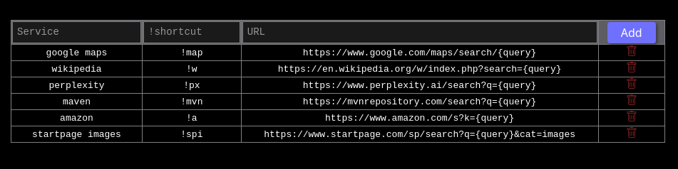

# S-bang
A Firefox extension that adds custom bang shortcuts to Startpage.
## Requirements
Startpage as default search engine.
Any Firefox based browser.
# How to use it
Go to the Exstensions and themes (Ctrl+Shift+A).
Go to the Preference option of the extension.
You will find the page with three fields to fill:
- **Service**: the name of the service you wanna be redirected (ex: youtube, DeepL, maven, perplexity, wikipedia)
- **Shortcuts**: the sequence of characters it must preceded by "!" (ex: !yt, !dpl, !mvn, !px, !w)
- **URL**: the url to be redirected. Every site has its own structure so you need to search, understand and add it here

Then press the button "add".
Open a new tab and search something on the site you wanna be redirected.
Examples of search: !yt hello world, !dpl hello world, !mvn jdbc, !px hello world, !w linear algebra
# Example

  

# How it works
**background.js**:
- Intercepts the GET request to Startpage via webRequest
- Extracts the query from the URL (ex: ?query=!yt hello world)
- Separates the bang !yt from the search terms hello world
- Looks up !yt in the g_bangs in-memory dictionary
- Replaces {query} in the URL with the search terms and redirects

**options.js**:
- The user adds and removes bangs from the table
- Saves the data to storage with browser.storage.local.set
- background.js updates automatically via onChanged
  
## Notes
The shortcuts work only from the omnibar.

This is a personal project, so it has not been published on the Firefox store yet.
